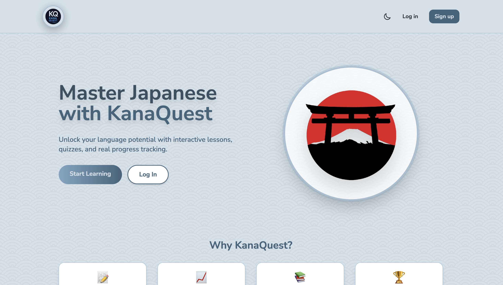
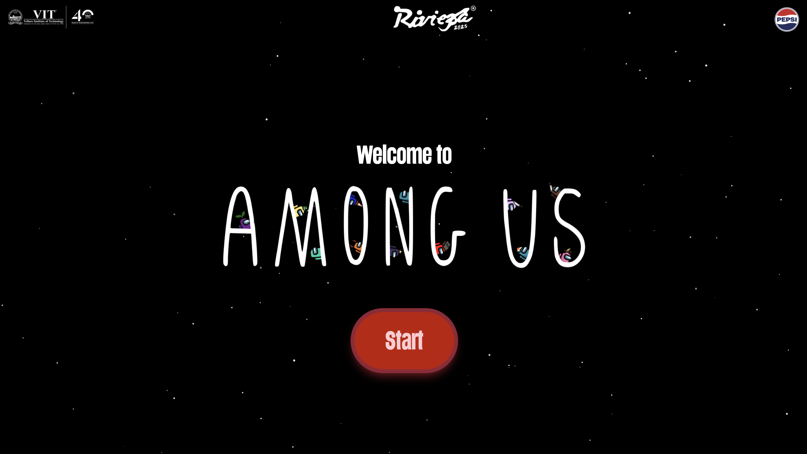

# 💼 Kritika Varyani's Developer Portfolio

🎨 A modern 3D developer portfolio showcasing my skills, projects, and experience using **React**, **Three.js**, and **TailwindCSS**.



---

## 🚀 Live Demo

🔗 [View Live Portfolio](https://kritikaIS.github.io/Kritika-s_portfolio)

---

## 🛠️ Tech Stack

- **Frontend:** React, TailwindCSS, JavaScript
- **3D Rendering:** Three.js, React Three Fiber, Drei
- **Animations:** Framer Motion
- **Version Control:** Git, GitHub

---

## 📂 Features

- 🎮 Interactive 3D animations and elements
- 📱 Fully responsive design
- 📁 Smooth page transitions
- 🧠 Modern, clean UI/UX
- 📧 Integrated contact form

---

## 🖼️ Sections

- Hero Section
- About Me
- Skills/Tech Stack
- Projects/Works
- Experience
- Contact Form

---

## 📸 Preview



---

## 📌 Setup Instructions

```bash
# Clone the repository
git clone https://github.com/kritikaIS/Kritika-s_portfolio.git

# Install dependencies
npm install

# Run the development server
npm run dev

📬 Contact
📧 kritika@example.com
🔗 LinkedIn
🐦 Twitter

